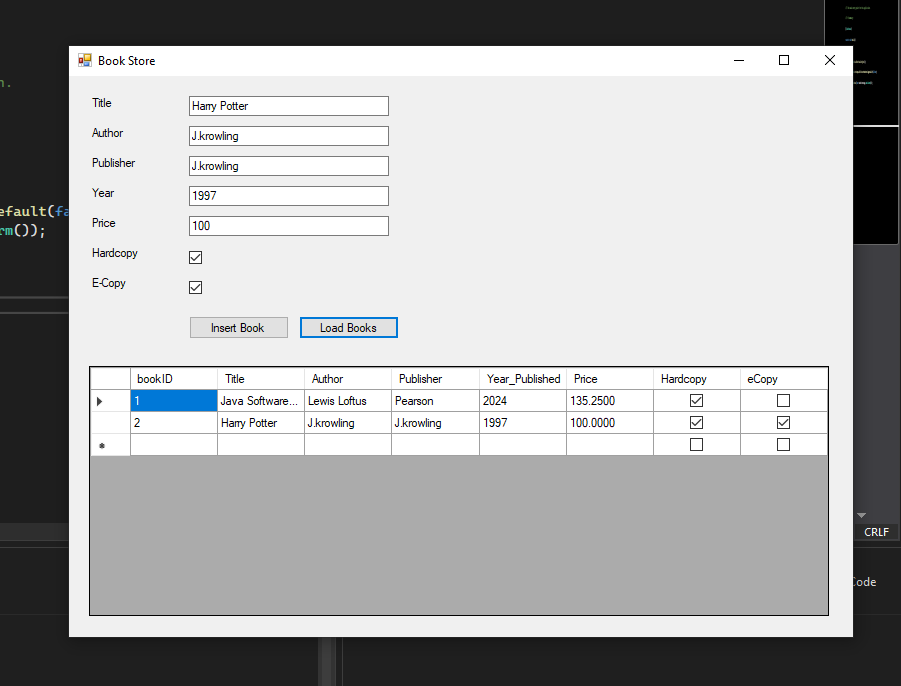

# 📚 BookStoreApp – Windows Forms Bookstore Inventory Manager

A Windows Forms desktop application built using **C#** and **SQL Server** to manage bookstore inventory efficiently. The app allows users to **insert**, **view**, and **print** book records. Designed for smooth UI interactions and secure data handling using parameterized SQL queries.

---

## 🛠 Features

- Add new books with title, author, publisher, year, price, and format (Hardcopy/eCopy)
- View all books in a responsive grid
- Generate printable reports sorted by book title
- Input validation to ensure data quality
- Auto-incremented Book IDs (handled by the database)

---

## 💻 Tech Stack

| Tool/Technology | Description |
|-----------------|-------------|
| C# (Windows Forms) | Frontend UI |
| .NET Framework | Application runtime |
| SQL Server Express | Backend database |
| Visual Studio 2022 | Development IDE |
| SSMS | Database management |
| ADO.NET | Database connectivity |
| RDLC | Reporting functionality |

---

## 🗃 Database Schema

**Table: textBook**
| Field         | Type      |
|---------------|-----------|
| BookID        | INT (PK, Identity) |
| Title         | NVARCHAR  |
| Author        | NVARCHAR  |
| Publisher     | NVARCHAR  |
| Year_Published| INT       |
| Price         | DECIMAL   |
| Hardcopy      | BIT       |
| eCopy         | BIT       |

---

## 📷 Screens & Forms

- **MainForm**: Insert books, load records, print books
- **NewBookForm**: Dedicated form for new book entry
- **ReportViewerForm**: Displays sorted report and handles print functionality

---

## 🖼️ Screenshots

### 📘 Main Form


### ➕ New Book Entry


### 📄 Report Viewer


---

## ⚙️ Setup Instructions

1. **Clone or Download** this repository
2. **Restore SQL Database**: 
    - Use SSMS to create the `BookStore` database
    - Run the table creation SQL for `textBook` (see schema above)
3. **Configure Connection String**:
    Update `App.config`:

    ```xml
    <connectionStrings>
      <add name="BookStoreConn" 
           connectionString="Data Source=(local)\SQLEXPRESS;Initial Catalog=BookStore;Integrated Security=True" 
           providerName="System.Data.SqlClient" />
    </connectionStrings>
    ```

4. **Run the Project** in Visual Studio (as a Windows Forms App)

---

## 🧪 Sample Data

Tested with:

- _Java Software Solutions_ – Both formats  
- _Harry Potter_ – Both formats  
- _The Pragmatic Programmer_ – eCopy only  
- _Clean Code_ – Hardcopy only

---

## ✅ Testing & Validation

- All forms tested for input validation and SQL exceptions
- Printing tested using `PrintPreviewDialog`
- Secure data operations using parameterized queries
- Smooth runtime without lag or errors

---

## 📌 Future Enhancements

- User authentication system
- Export to CSV or PDF
- Search/filter by author or year
- Update/delete functionality

---

## 📄 License

This project is intended for academic and demonstration purposes.

---

## 🙌 Acknowledgments

- Developed as part of **[Course Name]**
- Student: **[Your Name]**
- Instructor: **[Instructor Name, if applicable]**

